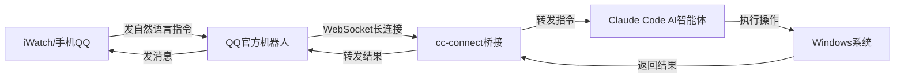

# iwatch-windows-control
# 全网首发：iWatch 一键控制 Windows 电脑，无需公网IP、无需内网穿透，一句话远程操控

## 无需公网 IP・无需内网穿透・一句话远程操控 

> 这是目前全网首发的完整解决方案，通过 **Claude Code + cc-connect + QQ 官方机器人** 实现了用 Apple Watch 随时随地控制你的 Windows 电脑。
> 
> 无论你在公司、在路上、还是在沙发上，只要手表能发 QQ 消息，就能一句话控制电脑：打开软件、截屏、关机、写代码、处理文件... 全程无需公网 IP，无需路由器配置，开箱即用。
> 
> 

---

## 📋 方案亮点

✅ **零网络配置**：无需公网 IP、无需内网穿透、无需端口映射
✅ **自然语言控制**：不用记命令，直接说中文就能控制
✅ **全系统权限**：支持键鼠模拟、文件操作、软件控制、系统命令
✅ **随时随地**：只要 iWatch 能联网，就能控制电脑
✅ **安全可控**：仅你自己的 QQ 号能控制，权限可配置
✅ **开源免费**：所有工具都是开源项目，免费使用

---

## 🏗️ 核心架构

### 工具分工

|工具|作用|运行位置|
|---|---|---|
|**iWatch / 手机 QQ**|指令发送端，随时随地发消息|你的手表 / 手机|
|**QQ 官方机器人**|消息中转站，接收你的控制指令|QQ 云端|
|**cc-connect**|桥接工具，打通 QQ 与 AI 智能体的通信|被控 Windows 电脑|
|**Claude Code**|AI 智能体，理解指令并控制电脑|被控 Windows 电脑|
### 完整工作链路


---

## 🧰 前置准备

### 系统要求

- Windows 10 1903+ 或 Windows 11

- Node.js 18+（必须，用于安装所有工具）

- Python 3.10+（Claude Code 系统控制依赖）

- 一个普通 QQ 号（用于注册机器人）

- （也可以不用）Anthropic 账号（用于 Claude Code 登录，免费额度足够日常使用）
  
### 环境安装

1. **安装 Node.js**

    - 下载地址：[https://nodejs.org/](https://nodejs.org/)

    - 安装时务必勾选 **"Add to PATH"**

2. **安装 Python**

    - 下载地址：[https://www.python.org/](https://www.python.org/)

    - 安装时务必勾选 **"Add Python to PATH"**

3. **验证环境**
以**管理员身份**打开 PowerShell，执行以下命令：

    ```powershell
    
    node -v
    npm -v
    python -V
    ```

    如果都能输出版本号，说明环境正常。

4. **解除 PowerShell 限制**

    ```powershell
    
    Set-ExecutionPolicy -ExecutionPolicy RemoteSigned -Scope CurrentUser
    ```

    输入`Y`确认，允许运行本地脚本。

---

## 🚀 第一步：安装 Claude Code

Claude Code 是 Anthropic 官方的终端 AI 智能体，拥有完整的 Windows 系统控制能力。

### 1. 安装 Claude Code

```powershell

npm install -g @anthropic-ai/claude-code
```

### 2. 登录账号

```powershell

claude login
```

按照提示打开浏览器，登录你的 Anthropic 账号，完成授权。

### 3. 开启系统控制权限

这是最关键的一步，开启后 Claude 才能控制你的电脑：

```powershell

claude mcp enable computer-use
```

### 4. 测试本地控制

先在本地测试一下 Claude 能不能控制电脑：

```powershell

claude "打开记事本并输入Hello World"
```

如果电脑自动打开了记事本并输入了文字，说明 Claude Code 安装成功！

---

## 🔌 第二步：安装 cc-connect

cc-connect 是专门开发的桥接工具，负责把 QQ 的消息转发给 Claude Code。

### 1. 安装最新 beta 版

```powershell

npm install -g cc-connect@beta
```

### 2. 初始化配置

```powershell

mkdir -p ~/.cc-connect
cc-connect config-example > ~/.cc-connect/config.toml
```

---

## 🤖 第三步：申请 QQ 官方机器人

### 1. 注册机器人

1. 打开 QQ 机器人平台：[https://bot.qq.com/](https://bot.qq.com/)

2. 使用你的 QQ 号登录

3. 点击**创建机器人**

4. 填写机器人名称、头像、描述

5. 选择**私域机器人**（只有你能使用，更安全）

### 2. 获取关键信息

1. 进入机器人管理后台 → **开发管理** → **开发设置**

2. 复制以下两个信息，后面配置要用：

    - `AppID`（机器人 ID）

    - `AppSecret`（机器人密钥）

### 3. 配置沙箱测试

1. 进入**沙箱配置**页面

2. 添加**你的 QQ 号**为沙箱测试用户

3. 扫码把机器人加为好友（沙箱环境下只有你能和它聊天）

---

## ⚙️ 第四步：配置连接

### 1. 编辑配置文件

打开文件：`C:\Users\你的用户名.cc-connect\config.toml`
把里面的内容全部替换成下面的配置：

```toml

# 全局配置
log_level = "info"
attachment_send = "on"  # 允许发送文件和图片回QQ

# 项目配置
[[projects]]
name = "iwatch-win-control"
agent = "claude"  # 使用Claude Code作为AI智能体
work_dir = "C:\\"  # Claude的默认工作目录，可改为你常用的目录
admin_from = "你的QQ号"  # 🔴 这里填你的QQ号！只有这个号能控制电脑

# 连接QQ官方机器人
[[projects.platforms]]
type = "qq-official"
[projects.platforms.options]
appid = "你的机器人AppID"  # 🔴 这里填你刚才复制的AppID
secret = "你的机器人AppSecret"  # 🔴 这里填你刚才复制的AppSecret
sandbox = true  # 测试阶段用true，正式用改为false
remove_at = true
intents = ["C2C_MESSAGE_CREATE", "GROUP_AT_MESSAGE_CREATE"]
```

### 2. 配置说明

- `admin_from`：**必须填你的 QQ 号**，否则任何人都能控制你的电脑！

- `sandbox`：测试时用`true`，确认没问题后改为`false`正式使用

- `work_dir`：Claude 默认操作的目录，比如可以改为`"C:\\Users\\你的用户名\\Desktop"`

---

## 🎮 第五步：启动并测试

### 1. 启动服务

在 PowerShell 中执行：

```powershell

cc-connect run
```

如果看到类似下面的输出，说明启动成功：

```Plain

[INFO] 项目 iwatch-win-control 已启动
[INFO] 平台 qq-official 已连接
[INFO] 代理 claude 已就绪
```

### 2. 用 iWatch 测试控制

1. 打开你 iWatch 上的 QQ

2. 找到你创建的机器人，发送消息：

    ```Plain
    
    打开浏览器并访问百度
    ```

3. 稍等 2-3 秒，你的电脑就会自动打开 Chrome 浏览器并访问百度！

4. 机器人还会把执行结果发回给你的手表

### 3. 常用测试指令

你可以试试这些指令，感受一下 AI 控制的强大：

- `截屏并把图片发给我`

- `打开计算器计算123乘以456`

- `5分钟后关机`

- `在桌面创建一个test.txt文件，内容是Hello from iWatch`

- `列出桌面所有的文件`

- `把D盘的照片文件夹压缩一下发给我`

---

## 🔄 可选：安装 cc-switch 切换 AI 模型

如果你没有 Anthropic 账号，或者想使用其他 AI 模型，可以安装 cc-switch 来切换 API 供应商。

### 1. 下载安装

从 Releases 页面下载：[https://github.com/farion1231/cc-switch/releases](https://github.com/farion1231/cc-switch/releases)

- Windows 用户下载`CC-Switch-Setup.msi`安装包

### 2. 使用方法

1. 打开 cc-switch

2. 点击 "添加供应商"

3. 选择你想使用的模型（通义千问、DeepSeek、Kimi 等）

4. 填写对应的 API Key

5. 切换后重启 cc-connect 即可生效

---

## 📝 常用命令

在和机器人聊天时，你可以使用这些 slash 命令：

|命令|功能|
|---|---|
|`/new`|开始一个新的会话|
|`/list`|列出所有会话|
|`/dir 路径`|切换 Claude 的工作目录|
|`/mode default`|恢复默认权限模式（每次操作询问）|
|`/model list`|列出可用的 AI 模型|
|`/model switch 模型名`|切换 AI 模型|
---

## 🔒 安全注意事项

1. **严格限制控制账号**：`admin_from`必须只填你自己的 QQ 号

2. **不要开启 yolo 模式**：`/mode yolo`会自动批准所有操作，非常危险

3. **定期更新工具**：

    ```powershell
    
    npm update -g @anthropic-ai/claude-code
    npm update -g cc-connect@beta
    ```

4. **添加杀毒白名单**：把这两个目录加到杀毒软件排除项：

    - `C:\Users\你的用户名.claude`

    - `C:\Users\你的用户名.cc-connect`

5. **不要在公共网络使用**：避免中间人攻击

---

## 🛠️ 故障排查

### 1. cc-connect 无法连接 QQ

- 检查 AppID 和 AppSecret 是否填错

- 确认沙箱配置正确

- 关闭 VPN 和代理，QQ 机器人需要直连网络

### 2. Claude 无法控制电脑

- 确认已执行`claude mcp enable computer-use`

- 以管理员身份运行 PowerShell

- 检查 Windows 开发者模式是否开启

### 3. 机器人收不到消息

- 确认你已经加了机器人为好友

- 确认你在沙箱测试用户列表里

- 重启 cc-connect 服务

### 4. 指令执行太慢

- 检查你的网络连接

- 可以试试切换到国内的 AI 模型（用 cc-switch）

---

## 🎉 写在最后

这就是目前全网首发的 iWatch 控制 Windows 的完整方案！

有了这个，你再也不用为了远程控制电脑折腾公网 IP、内网穿透、路由器配置了。
出门忘关电脑？手表发一句 "关机" 就行。
想让电脑帮你下载东西？手表发一句就行。
想看看电脑现在在干嘛？发一句 "截屏" 就行。

赶紧去试试吧！如果有问题，欢迎在 GitHub 上提 issue~

---

**相关开源项目**

- [anthropics/claude-code](https://github.com/anthropics/claude-code) - Anthropic 官方 AI 智能体

- [chenhg5/cc-connect](https://github.com/chenhg5/cc-connect) - 桥接工具

- [farion1231/cc-switch](https://github.com/farion1231/cc-switch) - API 供应商切换工具
