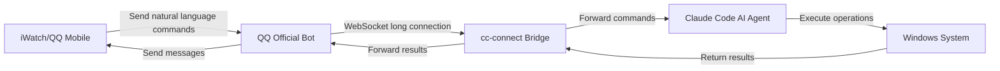

# iWatch Windows Control 

# World's First: Control Your Windows PC with iWatch, No Public IP, No Intranet Penetration

## No Public IP・No Intranet Penetration・Control with One Sentence

> This is the world's first complete solution that enables you to control your Windows PC from anywhere using your Apple Watch, via **Claude Code + cc-connect + QQ Official Bot**.
> 
> Whether you're at work, on the go, or on the couch, as long as your watch can send QQ messages, you can control your PC with one sentence: open apps, take screenshots, shut down, write code, process files... No public IP required, no router configuration needed, works out of the box.
> 
> 

---

## 📋 Features

✅ **Zero Network Configuration**: No public IP, no intranet penetration, no port mapping
✅ **Natural Language Control**: No commands to memorize, just speak naturally
✅ **Full System Access**: Supports keyboard/mouse simulation, file operations, app control, system commands
✅ **Work Anywhere**: Control your PC as long as your iWatch has internet
✅ **Secure & Private**: Only your QQ account can control your PC, fully configurable permissions
✅ **Open Source & Free**: All tools are open source projects, completely free to use

---

## 🏗️ Core Architecture

### Tool Roles

|Tool|Role|Running Location|
|---|---|---|
|**iWatch / QQ Mobile**|Command sender, send messages anytime anywhere|Your watch / phone|
|**QQ Official Bot**|Message relay, receives your control commands|QQ Cloud|
|**cc-connect**|Bridge tool, connects QQ with AI agent|Controlled Windows PC|
|**Claude Code**|AI agent, understands commands and controls your PC|Controlled Windows PC|
### Full Workflow


---

## 🧰 Prerequisites

### System Requirements

- Windows 10 1903+ or Windows 11

- Node.js 18+ (Required for installing all tools)

- Python 3.10+ (Required for Claude Code system control)

- A normal QQ account (For registering the bot, needs developer verification)

- (Optional) Anthropic account (For Claude Code login, free quota is enough for daily use)

### Environment Setup

1. **Install Node.js**

    - Download: [https://nodejs.org/](https://nodejs.org/)

    - Make sure to check **"Add to PATH"** during installation

2. **Install Python**

    - Download: [https://www.python.org/](https://www.python.org/)

    - Make sure to check **"Add to PATH"** during installation

3. **Verify Environment**
Open PowerShell **as Administrator**, run these commands:

    ```powershell
    
    node -v
    npm -v
    python -V
    ```

    If you see version numbers, your environment is ready.

4. **Unlock PowerShell Restrictions**

    ```powershell
    
    Set-ExecutionPolicy -ExecutionPolicy RemoteSigned -Scope CurrentUser
    ```

    Type `Y` to confirm, this allows running local scripts.

---

## 🚀 Step 1: Install Claude Code

> Official repo: [anthropics/claude-code](https://github.com/anthropics/claude-code)
> 
> 

Claude Code is Anthropic's official terminal AI agent with full Windows system control capabilities.

### 1. Install Claude Code

```powershell

npm install -g @anthropic-ai/claude-code
```

### 2. Login to your account

```powershell

claude login
```

Follow the prompt to open your browser, login to your Anthropic account, and complete authorization.

### 3. Enable System Control Permission

This is the most critical step, after enabling this Claude can control your PC:

```powershell

claude mcp enable computer-use
```

### 4. Test Local Control

Test if Claude can control your PC locally first:

```powershell

claude "Open notepad and type Hello World"
```

If your PC automatically opens notepad and types the text, Claude Code is installed successfully!

---

## 🔌 Step 2: Install cc-connect

> Official repo: [chenhg5/cc-connect](https://github.com/chenhg5/cc-connect)
> 
> 

cc-connect is a bridge tool that forwards QQ messages to Claude Code.

### 1. Install the latest beta version

```powershell

npm install -g cc-connect@beta
```

### 2. Initialize Configuration

```powershell

mkdir -p ~/.cc-connect
cc-connect config-example > ~/.cc-connect/config.toml
```

---

## 🤖 Step 3: Apply for QQ Official Bot

> Official docs: [QQ Bot Platform Setup Guide](https://github.com/chenhg5/cc-connect/blob/main/docs/platforms/qqbot.md)
> 
> 

### 1. Register the Bot

1. Open QQ Bot Platform: [https://bot.qq.com/](https://bot.qq.com/)

2. Login with your QQ account, complete **developer verification** (Required, otherwise you can't publish the bot)

3. Click **Create Bot**

4. Fill in the bot name, avatar, description

5. Choose **Private Bot** (Only you can use it, more secure)

### 2. Get Key Information

1. Go to Bot Management → **Development** → **Development Settings**

2. Copy these two information, you'll need them for configuration:

    - `AppID` (Bot ID)

    - `AppSecret` (Bot Secret Key)

### 3. Configure Sandbox Testing

1. Go to **Sandbox Configuration** page

2. Add **your QQ account** as a sandbox test user

3. Scan the QR code to add the bot as friend (Only you can chat with it in sandbox mode)

4. ⚠️ After testing, remember to submit the bot for review to **publish** it, otherwise you can't use it officially.

---

## ⚙️ Step 4: Configure Connection

### 1. Edit the Configuration File

Open this file: `C:\Users\YourUsername.cc-connect\config.toml`
Replace all content with this official standard configuration:

```toml

# Global configuration
log_level = "info"
attachment_send = "on"  # Allow sending files and images back to QQ

# Project configuration
[[projects]]
name = "iwatch-win-control"
agent = "claude"  # Use Claude Code as AI agent
work_dir = "C:\\"  # Default working directory for Claude, you can change it
admin_from = "YourQQNumber"  # 🔴 Fill your QQ number here! Only you can control the PC

# Connect to QQ Official Bot
[[projects.platforms]]
type = "qq-official"  # Official platform type, DO NOT CHANGE
[projects.platforms.options]
appid = "YourBotAppID"  # 🔴 Fill the AppID you copied earlier
secret = "YourBotAppSecret"  # 🔴 Fill the AppSecret you copied earlier
sandbox = true  # ✅ Use true for testing, change to false for production
remove_at = true
intents = ["C2C_MESSAGE_CREATE", "GROUP_AT_MESSAGE_CREATE"]
```

### 2. Configuration Explanation

- `type = "qq-official"`: The only correct platform type cc-connect recognizes, don't use `qqbot`

- `appid` / `secret`: Official parameter names, **no underscores**, otherwise configuration will fail

- `admin_from`: **Must fill your QQ number**, this is the most secure permission control

- `sandbox`: Use `true` for testing, change to `false` after confirmation

- `work_dir`: Default working directory for Claude, e.g. `"C:\\Users\\YourUsername\\Desktop"`

---

## 🎮 Step 5: Start and Test

### 1. Start the Service

Run this in PowerShell:

```powershell

cc-connect run
```

If you see output like this, it means startup is successful:

```Plain Text

qqbot: connected to QQ Bot gateway   sandbox=true
qqbot: gateway READY                 session_id=xxx
[INFO] Project iwatch-win-control started
[INFO] Platform qq-official connected
[INFO] Agent claude ready
```

### 2. Test with iWatch

1. Open QQ on your iWatch

2. Find the bot you created, send a message:

    ```Plain Text
    
    Open the browser and visit Baidu
    ```

3. Wait 2-3 seconds, your PC will automatically open Chrome and visit Baidu!

4. The bot will also send the execution result back to your watch.

### 3. Common Test Commands

Try these commands to feel the power of AI control:

- `Take a screenshot and send it to me`

- `Open calculator and calculate 123 times 456`

- `Shut down in 5 minutes`

- `Create a test.txt file on desktop with content Hello from iWatch`

- `List all files on desktop`

- `Compress the photos folder on D drive and send it to me`

---

## 🔄 Optional: Install cc-switch to Switch AI Models

> Official repo: [farion1231/cc-switch](https://github.com/farion1231/cc-switch)
> 
> 

If you don't have an Anthropic account, or want to use faster domestic AI models, you can install cc-switch to switch API providers with one click.

### Supported Models

cc-switch supports one-click switching for these mainstream AI models:

- Qwen (Alibaba Cloud)

- DeepSeek

- Kimi (Moonshot)

- Ernie (Baidu)

- Doubao (ByteDance)

- Spark (iFlytek)

- And other OpenAI-compatible APIs

### 1. Download and Install

Download from official Releases: [https://github.com/farion1231/cc-switch/releases](https://github.com/farion1231/cc-switch/releases)

- Windows users download `CC-Switch-Setup.msi` installer

- Or download portable version `CC-Switch-Windows-Portable.zip`

### 2. How to Use

1. Open cc-switch software

2. Click **Add Provider**

3. Select the AI model you want to use

4. Fill in the corresponding **API Key** (Get it from the model's official website)

5. Select the provider you want to use

6. ⚠️ After switching, **you must restart cc-connect** for it to take effect.

---

## 📝 Common Commands

You can use these slash commands when chatting with the bot:

|Command|Function|
|---|---|
|`/new`|Start a new session|
|`/list`|List all sessions|
|`/dir path`|Change Claude's working directory|
|`/mode default`|Restore default permission mode (ask before each operation)|
|`/model list`|List available AI models|
|`/model switch modelname`|Switch AI model|
---

## 🔒 Security Notes

1. **Strictly limit control account**: `admin_from` must only fill your own QQ number

2. **Don't enable yolo mode**: `/mode yolo` will automatically approve all operations, very dangerous

3. **Update tools regularly**:

    ```powershell
    
    npm update -g @anthropic-ai/claude-code
    npm update -g cc-connect@beta
    ```

4. **Add antivirus whitelist**: Add these two directories to your antivirus exclusion:

    - `C:\Users\YourUsername.claude`

    - `C:\Users\YourUsername.cc-connect`

5. **Don't use on public network**: Avoid man-in-the-middle attacks

---

## 🛠️ Troubleshooting

### 1. cc-connect can't connect to QQ

- Check if AppID and AppSecret are filled correctly

- Confirm sandbox configuration is correct

- Close VPN and proxy, QQ Bot needs direct network access

### 2. Claude can't control the PC

- Confirm you ran `claude mcp enable computer-use`

- Run PowerShell as Administrator

- Check if Windows Developer Mode is enabled

### 3. Bot doesn't receive messages

- Confirm you added the bot as friend

- Confirm you are in the sandbox test user list

- Restart cc-connect service

### 4. Commands execute too slow

- Check your network connection

- Try switching to a domestic AI model (using cc-switch)

---

## 🎉 Wrap Up

This is the world's first complete solution for controlling Windows with iWatch!

With this, you never need to mess with public IP, intranet penetration, or router configuration for remote control again.
Forgot to turn off your PC before leaving? Just send "shutdown" from your watch.
Want your PC to download something for you? Just send a message from your watch.
Want to check what your PC is doing now? Just send "screenshot".

Go try it! If you have any problems, feel free to open an issue on GitHub~

---

## 🙏 Acknowledgements

This solution wouldn't be possible without the following open source projects and their contributors, sincere thanks to them!

|Project|Author|Open Source Repo|
|---|---|---|
|Claude Code|Anthropic|[anthropics/claude-code](https://github.com/anthropics/claude-code)|
|cc-connect|@chenhg5|[chenhg5/cc-connect](https://github.com/chenhg5/cc-connect)|
|cc-switch|@farion1231|[farion1231/cc-switch](https://github.com/farion1231/cc-switch)|
Thanks to all open source developers for their hard work!
